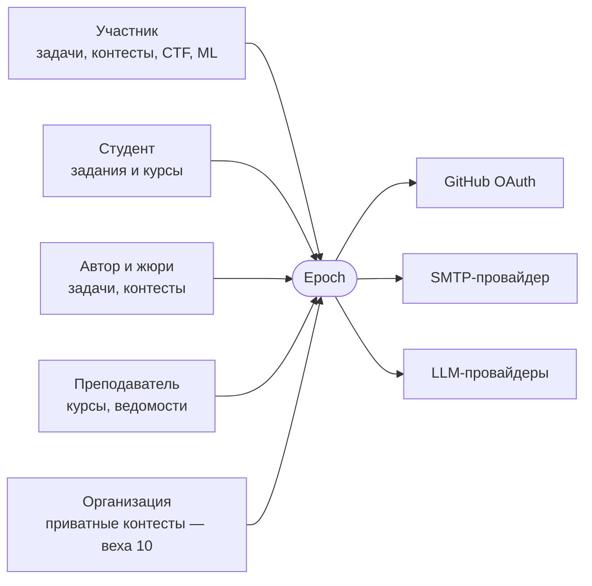
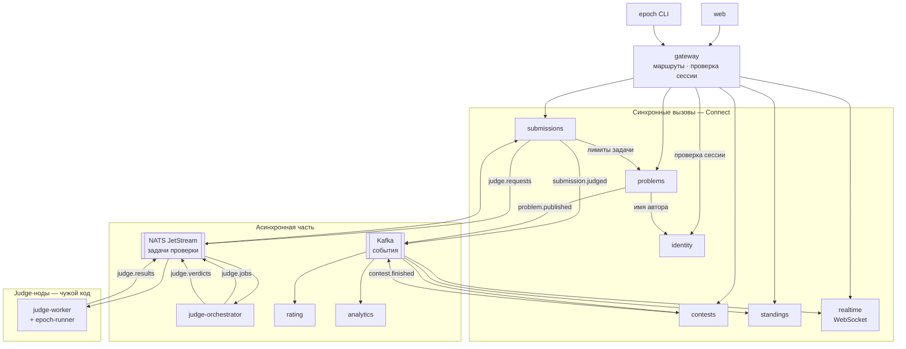
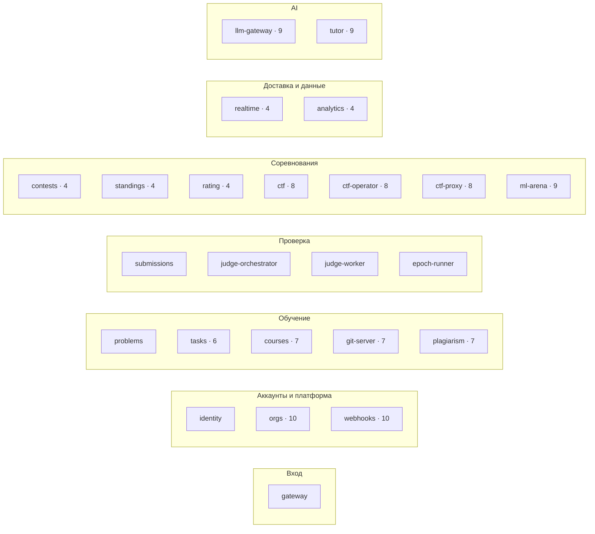

# Архитектура

Epoch — микросервисы в одной монорепе. Каждый сервис владеет своей базой и своим proto-контрактом и деплоится отдельно. Клиенты ходят через gateway по Connect. Проверка решений идёт через очереди NATS JetStream, факты о событиях (вердикт, конец контеста) — через Kafka. Сервисы появляются по мере того, как их требует продукт: на старте их три, к концу роадмапа — около двадцати пяти.

| Документ | О чём |
| --- | --- |
| [submission-flow.md](submission-flow.md) | Путь сабмита через сервисы, статусы, гарантии |
| [sandbox.md](sandbox.md) | Песочница: слои изоляции, запуск, вердикты, атаки |
| [grading.md](grading.md) | Задания в формате ШАД: стадии проверки, образы, приватные тесты |
| [contests.md](contests.md) | Контесты, live-таблица, заморозка, рейтинг |
| [courses.md](courses.md) | Курсы, git-сервер, дедлайны, антиплагиат |
| [ctf.md](ctf.md) | CTF: флаги, оператор инстансов, сетевая изоляция |
| [ml-and-ai.md](ml-and-ai.md) | ML-соревнования и AI-тьютор |
| [events.md](events.md) | Очереди, топики, формат событий, outbox |
| [data.md](data.md) | Базы сервисов и где какие данные живут |
| [deployment.md](deployment.md) | Окружения, VPS, Kubernetes, CI/CD, бэкапы |
| [security.md](security.md) | Зоны доверия, аутентификация между сервисами, модель угроз |

## Контекст



## Сервисы после вехи 4

Так система выглядит, когда готовы judge и контесты. У каждого сервиса своя база — на схеме их нет, чтобы не загромождать.



## Карта всех сервисов по доменам



Цифра — веха, в которой появляется сервис. Без цифры — вехи 0–2.

## Каталог сервисов

| Сервис | Отвечает за | Язык | Хранилище | Веха |
| --- | --- | --- | --- | --- |
| gateway | Единый вход, маршруты, TLS, проверка сессии, rate limit на входе | Caddy → Envoy Gateway | — | 0, 5 |
| identity | Пользователи, сессии, OAuth, роли, внутренние токены и JWKS | Go | PostgreSQL | 0, 3 |
| problems | Олимпиадные задачи, версии, пакеты, тесты | Go | PostgreSQL, S3 | 0, 2 |
| submissions | Приём сабмитов, статусы, история, снимок лимитов | Go | PostgreSQL (партиции), S3 | 2 |
| judge-orchestrator | Пулы, приоритеты, повторы, dead letter, rejudge | Go | PostgreSQL, NATS | 2 |
| judge-worker | Компиляция, запуск, стадии проверки | Rust | Локальный кэш тестов | 2 |
| epoch-runner | Песочница: CLI и библиотека для воркера | Rust | — | 1 |
| contests | Контесты, регистрация, правила, вопросы жюри | Go | PostgreSQL | 4 |
| standings | Таблицы результатов и заморозка (read model) | Go | Redis | 4 |
| rating | Glicko-2, история рейтинга | Go | PostgreSQL | 4 |
| realtime | WebSocket, подписки, fan-out | Go | Redis Pub/Sub | 4 |
| analytics | События → ClickHouse, дашборды | Go | ClickHouse | 4 |
| tasks | Задания в формате ШАД, шаблоны, приватные тесты | Go | PostgreSQL, S3 | 6 |
| courses | Курсы, группы, дедлайны, ведомость, ревью | Go | PostgreSQL | 7 |
| git-server | Репозитории, smart HTTP, хуки | Go | Диск, бэкапы в S3 | 7 |
| plagiarism | Отпечатки кода, отчёты о списывании | Go | PostgreSQL | 7 |
| ctf | CTF, флаги, скоринг | Go | PostgreSQL | 8 |
| ctf-operator | Инстансы задач как ресурсы Kubernetes | Go, kubebuilder | CRD | 8 |
| ctf-proxy | TCP-доступ команд к инстансам | Go | — | 8 |
| ml-arena | Датасеты, метрики, лидерборды | Python | PostgreSQL, S3 | 9 |
| llm-gateway | Доступ к LLM, бюджеты, кэш | Go | PostgreSQL, Redis | 9 |
| tutor | Подсказки, RAG по разборам | Python | PostgreSQL + pgvector | 9 |
| orgs | Организации, участники, контекст тенанта | Go | PostgreSQL | 10 |
| webhooks | Подписки и доставка вебхуков | Go | PostgreSQL | 10 |

## Как сервисы общаются

| Способ | Когда | Пример |
| --- | --- | --- |
| **Connect** (gRPC или HTTP/JSON) | Нужен ответ прямо сейчас, и без него запрос не выполнить | submissions берёт лимиты задачи у problems при приёме |
| **Локальная копия из событий** | Данные чужого сервиса нужны часто, а небольшая задержка не страшна | contests хранит названия задач из `problem.published` |
| **NATS JetStream** | Работа, которую надо довести до конца: очередь с ack, повторами и dead letter | Проверить сабмит |
| **Kafka** | Факт уже случился, у него много подписчиков, важен порядок и возможность перечитать | `submission.judged`, `contest.finished` |
| **WebSocket** через realtime | Сервер сам сообщает клиенту об изменении | Live-таблица, статус проверки |

## Правила

1. **Своя база у каждого сервиса.** В одном Postgres-кластере, но отдельная база и отдельная роль. Чужие данные — только через API или события.
2. **Контракт — только proto.** Всё, что сервис отдаёт наружу (API и события), описано в `proto/`. `buf breaking` в CI не пускает несовместимые изменения.
3. **В `pkg/` — только платформа.** Запуск сервера, конфиг, трейсы, аутентификация, outbox, клиенты с ретраями. Доменные типы и логика туда не попадают.
4. **Каждый синхронный вызов — с дедлайном.** Ретраи — только для идемпотентных вызовов, с jitter и circuit breaker.
5. **Изменение и событие — в одной транзакции** через outbox. Консьюмеры идемпотентны.
6. **Контекст идёт сквозь всё:** `traceparent`, пользователь и организация — через вызовы и заголовки сообщений.
7. **Сервисы не верят заголовкам.** Личность пользователя — только из подписанного внутреннего токена, который выдал identity.
8. **Сервис одинаковый снаружи:** `/healthz`, `/readyz`, метрики, JSON-логи, graceful shutdown — из шаблона.
9. **Признак ошибки в границах:** если одну фичу приходится одновременно деплоить в три сервиса или сервисы ходят друг к другу по кругу, границы надо пересмотреть и записать ADR.

## Раскладка монорепы

```text
proto/epoch/<сервис>/v1/      контракты API
proto/epoch/events/v1/        конверт и события
pkg/                          платформенный Go-код, без доменной логики
  server/ config/ observability/ authn/ resilience/
  postgres/ outbox/ events/ ratelimit/
services/<сервис>/            cmd/, internal/, migrations/
services/runner/              Rust, epoch-runner
services/judge-worker/        Rust
services/ml-arena/            Python
services/tutor/               Python
cli/epoch/                    Go
web/                          Next.js, пишет ИИ
templates/service/            шаблон нового сервиса
deploy/docker/                общие Dockerfile
deploy/compose/               локально и VPS
deploy/terraform/             инфраструктура, веха 5
deploy/k8s/services/<сервис>/ манифесты для Argo CD, веха 5
examples/                     задачи и задания
docs/                         документация
go.mod  Cargo.toml  Taskfile.yml
```

Один `go.mod` на все Go-сервисы: всё собирается из одного коммита, а общий код не нужно версионировать. CI собирает и деплоит только затронутые сервисы.

## Стек

| Слой | Выбор | Почему | Веха |
| --- | --- | --- | --- |
| Сервисы | Go, Connect, sqlc, pgx | Простой язык для сервисов, типизированный SQL, gRPC и JSON одним кодом | 0 |
| Контракты | Protobuf + Buf | Один источник правды для CLI, web и сервисов, проверка совместимости в CI | 0 |
| Gateway | Caddy, потом Envoy Gateway | Сначала просто, в Kubernetes — Gateway API и ext_authz | 0, 5 |
| Песочница и воркер | Rust, tokio, nix | Системный код без сборщика мусора и с безопасной памятью | 1 |
| Базы сервисов | PostgreSQL, база на сервис | Транзакции, партиционирование, RLS, pgvector | 2 |
| Файлы | S3 (MinIO локально) | Код и тесты по хэшу | 2 |
| Очередь проверки | NATS JetStream | Work queue с ack и повторами, лёгкий в эксплуатации | 2 |
| События | Kafka (Redpanda локально) | Лог с порядком по ключу и перечитыванием | 4 |
| Кэш и таблицы | Redis | Sorted sets, Pub/Sub, rate limit | 3 |
| Аналитика | ClickHouse | Колоночная OLAP-база | 4 |
| Наблюдаемость | OpenTelemetry, Grafana, Tempo, Loki, Mimir | Трейс через все сервисы и очереди | 0 |
| Деплой | VPS + compose, потом k3s + Argo CD + Terraform | Сначала продукт, потом Kubernetes | 0, 5 |
| Авторизация | Своя в identity, потом OpenFGA | Понять изнутри, потом отношения вместо ролей | 3, 10 |
| Service mesh | Istio ambient или Linkerd | mTLS и политики между сервисами | 10 |
| ML и AI | Python, FastAPI, pgvector | Экосистема ML | 9 |
| Фронтенд | Next.js, Tailwind, shadcn/ui, connect-web | Пишет ИИ | 3 |
