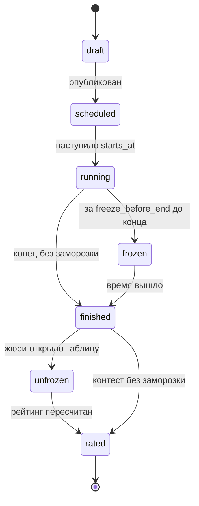
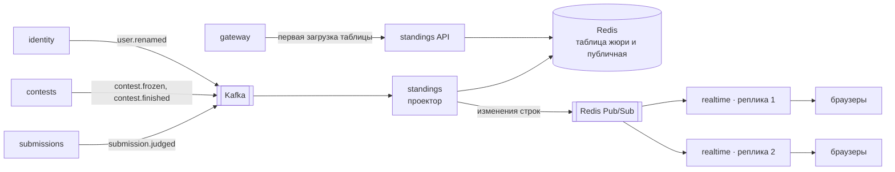
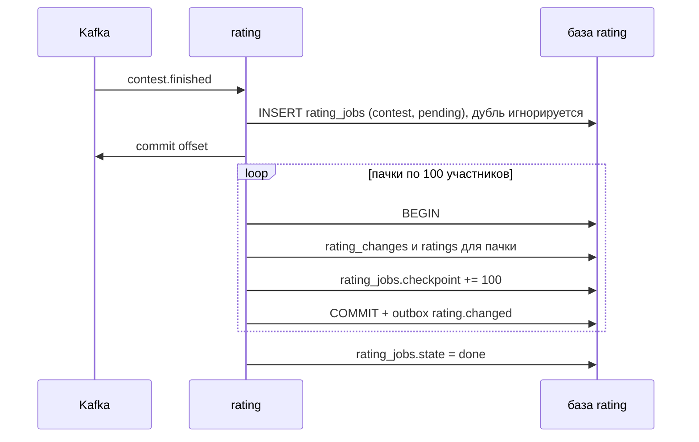

# Контесты, таблица и рейтинг

Контест складывается из пяти сервисов. contests хранит правила и расписание. submissions принимает сабмиты. standings собирает таблицу из событий в Redis, realtime доставляет изменения в браузер, rating пересчитывает рейтинг после конца. Таблица — это проекция (read model): её всегда можно пересобрать с нуля, перечитав Kafka.

## Жизненный цикл контеста

Переходы по времени делает планировщик в contests. На каждый переход в Kafka уходит событие `contest.*`.

## Как собирается live-таблица

Порядок событий одного контеста гарантирован: ключ партиции в `submissions.v1` — `contest_id`.

## Структуры в Redis

| Ключ | Тип | Что внутри |
| --- | --- | --- |
| `standings:{contest}:jury` | sorted set | Участники по счёту для жюри |
| `standings:{contest}:public` | sorted set | Участники по счёту для всех, замирает при заморозке |
| `standings:{contest}:row:{user}` | hash | Попытки и время по каждой задаче |
| `standings:{contest}:seen` | set с TTL | id обработанных событий для дедупликации |

Счёт ICPC упаковывается в одно число: `score = solved × 10⁷ − penalty_minutes`. Число помещается в double без потери точности, а сортировка по нему совпадает с правилами ICPC.

## Правила подсчёта

| | ICPC | IOI |
| --- | --- | --- |
| Балл за задачу | 1, если решена | Сумма баллов по группам тестов |
| Штраф | Минуты до OK + 20 за каждую неудачную попытку до OK | Нет |
| Какой сабмит считается | Первый OK | Лучший по баллам |
| Сортировка | Решённые ↓, штраф ↑ | Сумма ↓ |
| Заморозка | Попытки после заморозки видны как «?» | Обычно без заморозки |

Правила — чистые функции без ввода-вывода: список событий на входе, таблица на выходе. Поэтому их легко покрыть табличными и property-based тестами.

## Заморозка

1. После `contest.frozen` проектор продолжает обновлять таблицу жюри, а публичную — только счётчиком попыток «?».
2. После `contest.finished` жюри открывает таблицу. Публичная таблица перестраивается из таблицы жюри, можно по одной строке снизу вверх — как на ICPC.
3. realtime отдаёт участникам публичную таблицу, жюри — таблицу жюри. Права берутся из внутреннего токена.

## Пересчёт рейтинга

Если rating упадёт посреди пересчёта, при старте он найдёт незавершённые задачи и продолжит с чекпоинта. Изменения пачки и продвижение чекпоинта идут в одной транзакции, поэтому ни один участник не получит изменение рейтинга дважды. Вариант на Temporal сравнивается в ADR-003.

## Glicko-2 в двух словах

- У игрока три числа: рейтинг, отклонение (насколько мы в нём уверены) и волатильность (насколько он скачет).
- После контеста каждый участник сравнивается с каждым как в серии партий.
- Долго не играешь — отклонение растёт, следующий контест сдвинет рейтинг сильнее.
- Проверка реализации — числа из примера в статье Марка Глицкмана «Example of the Glicko-2 system».

## Время

- Время сабмита — момент приёма в submissions, по часам сервера. Клиентскому времени не верим.
- Окно контеста проверяется при приёме: submissions держит локальную копию расписания из событий `contest.scheduled` и не спрашивает contests на каждый сабмит.
- Всё хранится в UTC (`timestamptz`), в часовой пояс переводит только интерфейс.
