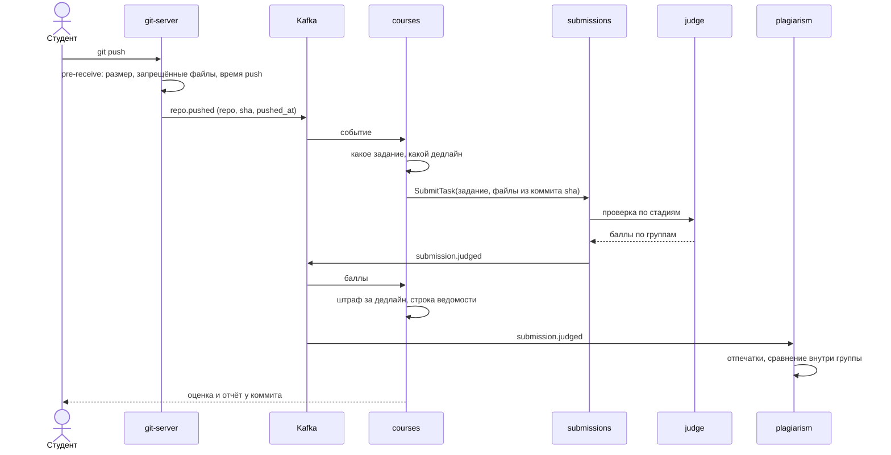
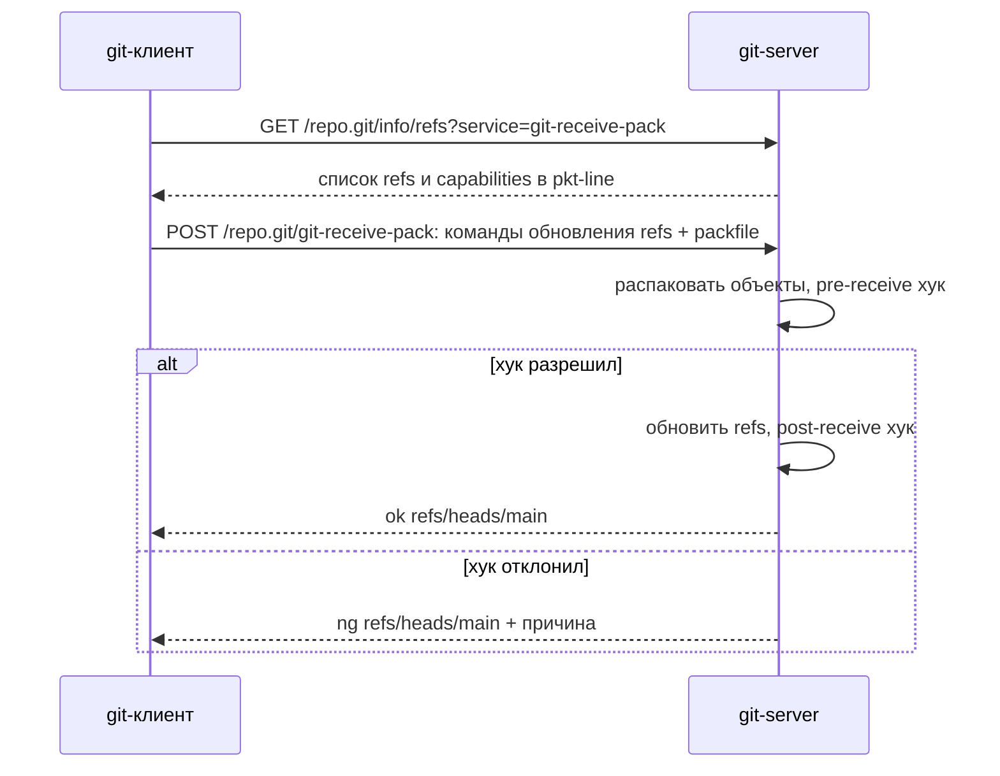
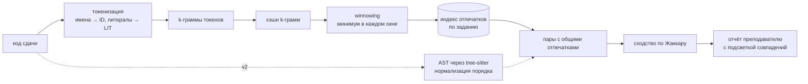
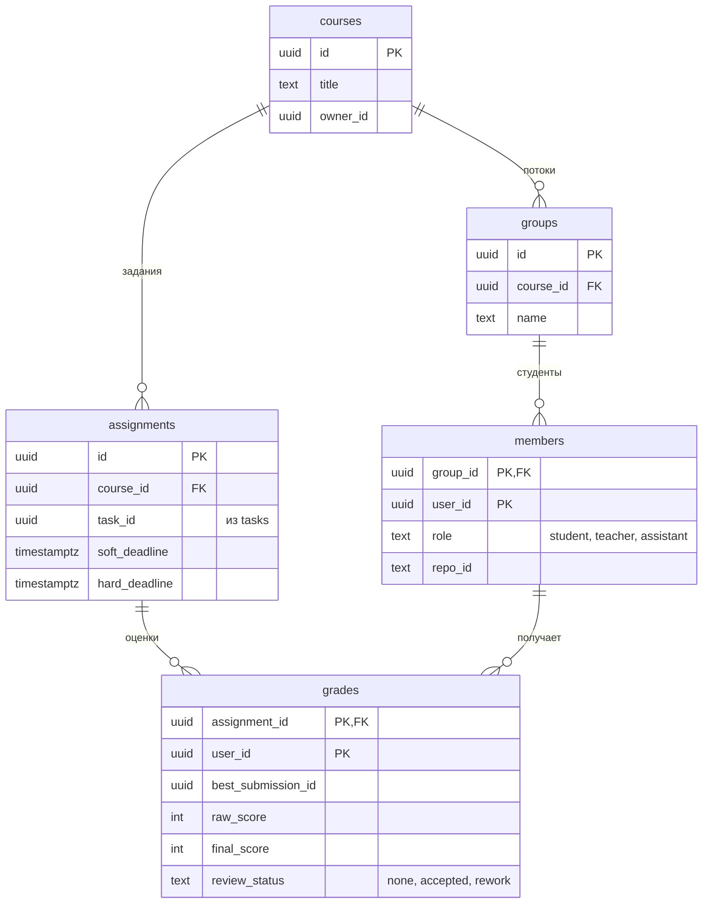

# Курсы, git и антиплагиат

Курс — это группа студентов, набор заданий из tasks и дедлайны. Студент сдаёт работу через git push в свой репозиторий. git-server проверяет push хуком и публикует `repo.pushed`, courses создаёт сабмит, а дальше работает та же проверка по стадиям, что и в [заданиях в формате ШАД](grading.md). plagiarism сравнивает сдачи внутри группы, преподаватель ревьюит код по строкам.

## Путь от push до оценки

Время сдачи — это `pushed_at` на сервере. Дату коммита легко подделать через `git commit --date`, поэтому ей не верим.

## Компоненты

| Компонент | Как сделать |
| --- | --- |
| Git-сервер | На старте Forgejo с вебхуком, потом свой на Go: smart HTTP, `git-upload-pack` и `git-receive-pack`, хуки |
| Хранение репозиториев | Диск git-server, бэкап через `git bundle` в S3 |
| Шаблон задания | Репозиторий-шаблон курса; приватные тесты хранятся в tasks и в репозиторий не попадают |
| Проверка | Сабмит типа `task`, тот же пайплайн стадий, что и при отправке файлами |
| Дедлайн | Мягкий и жёсткий; время — `pushed_at` |
| Ревью | Комментарии к строкам диффа, статус «принято / на доработку» |
| Антиплагиат | Сравнение внутри группы и с прошлыми годами, анализ истории коммитов |

## Протокол git в двух словах

## Дедлайны и оценка

| Когда сдано | Оценка |
| --- | --- |
| До мягкого дедлайна | Баллы проверки полностью |
| Между мягким и жёстким | Минус 10% за каждые начатые сутки, не больше 50% |
| После жёсткого | Сдача принимается, но в ведомость не идёт |

Оценка за задание — лучшая по итоговому баллу сдача с учётом штрафа. Правила можно менять на уровне курса.

## Антиплагиат

Дополнительные сигналы из истории git: один огромный коммит за минуту до дедлайна или код, который появился целиком без промежуточных состояний. Это не доказательство, а флаг для преподавателя.

## Модель данных courses

