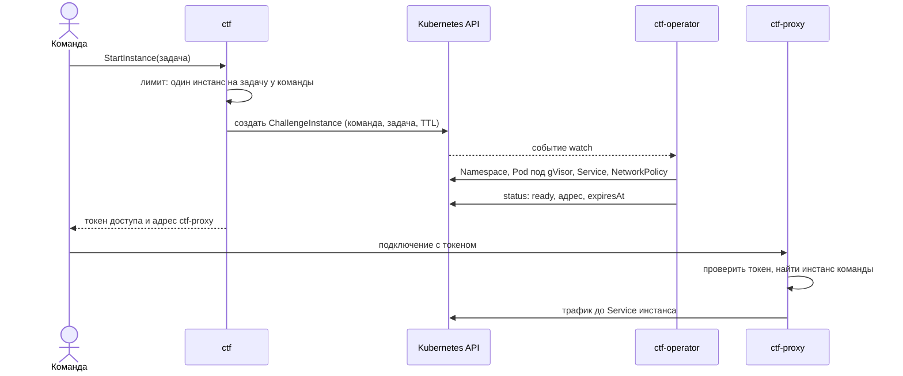
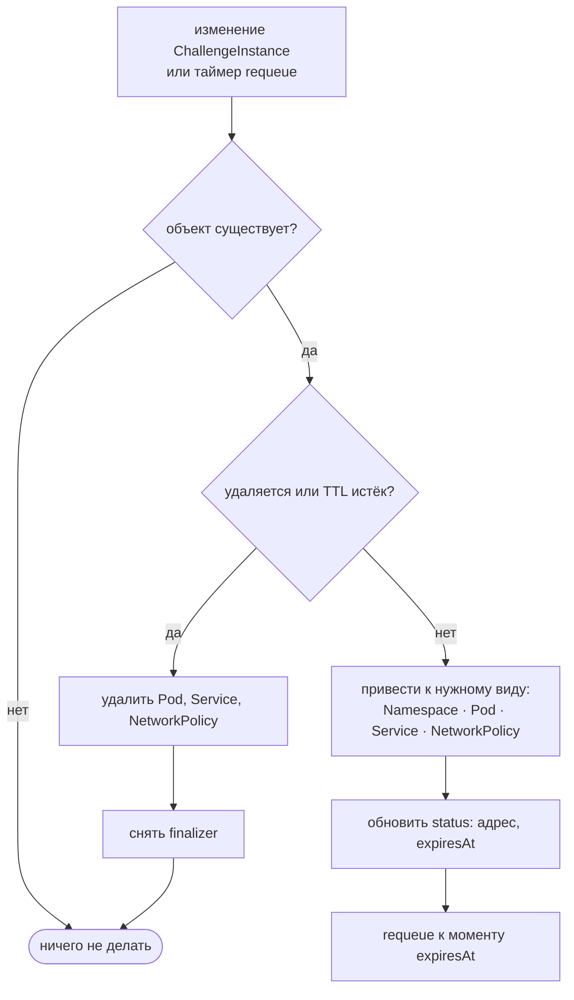
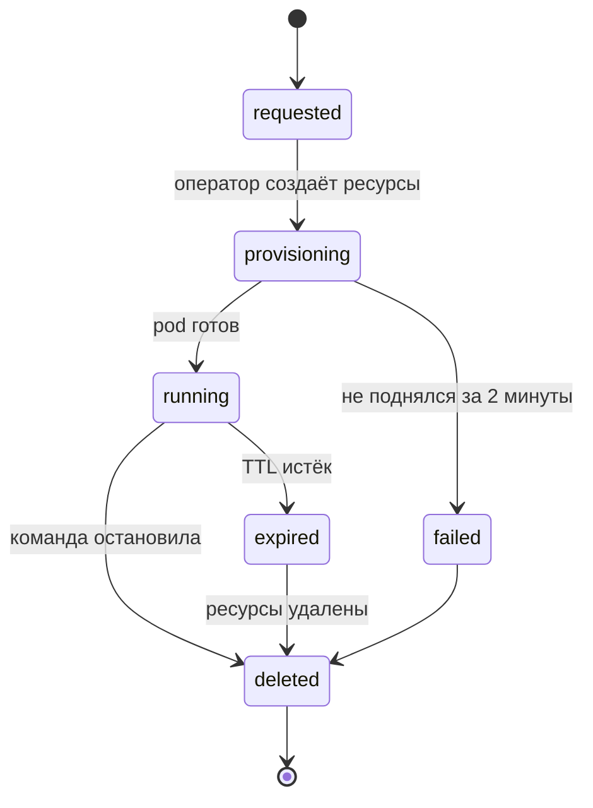
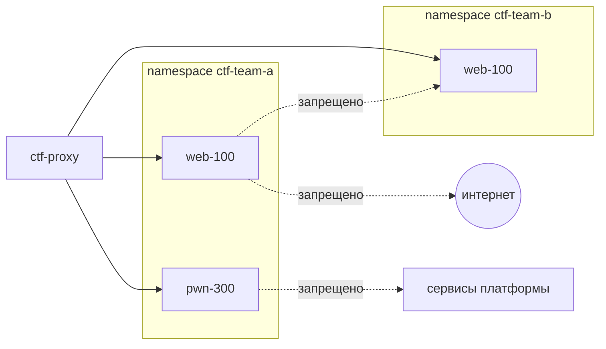

# CTF

CTF — это три сервиса. ctf хранит задачи, флаги и скоринг. ctf-operator — контроллер Kubernetes, который поднимает инстанс задачи для каждой команды и удаляет его по TTL. ctf-proxy пускает команду к её инстансу через один вход. Инстансы — самая опасная часть платформы: внутри намеренно уязвимые программы, а атакуют их намеренно.

## Как команда получает инстанс



## Цикл reconcile оператора



Контроллер не запоминает, что делал раньше: на каждом цикле он сравнивает желаемое с тем, что есть, и исправляет разницу. Поэтому его можно перезапустить в любой момент.

## Жизнь инстанса



## Сетевая изоляция



- Namespace на команду, default-deny: разрешён только входящий трафик от ctf-proxy.
- Egress запрещён: инстанс не может скачать эксплойт или атаковать внешние адреса.
- Отдельный node pool с taint, инстансы не попадают на ноды с сервисами и judge.
- RuntimeClass `gvisor`: побег из контейнера упирается в ядро в user space, а не в ядро хоста.
- Лимиты CPU и памяти на pod, TTL 1–2 часа.

## Флаги

- **Статические:** в базе хранится `HMAC(pepper, флаг)`, сравнение за постоянное время.
- **Динамические:** `флаг = "epoch{" + hex(HMAC(секрет_задачи, team_id))[:32] + "}"`. Оператор кладёт флаг в инстанс при создании.
- **Флаг чужой команды** узнаётся сразу: вычисляем HMAC для всех команд и находим владельца. Это сигнал модератору.
- **Лимит попыток:** 10 в минуту на команду и задачу.

## Dynamic scoring

Стоимость задачи падает по мере того, как её решают:

```text
value = max(minimum, initial + (minimum − initial) × solves² / decay²)
```

`initial` — стоимость без решений, `minimum` — нижняя граница, `decay` — после скольких решений стоимость доходит до минимума. При каждом новом решении пересчитываются очки всех команд, которые решили эту задачу.

## Задача «сломай judge»

Копия epoch-runner в отдельном инстансе с тем же набором защит. Флаг лежит вне песочницы. Всё, что найдут участники, — готовые баг-репорты для настоящего runner.
