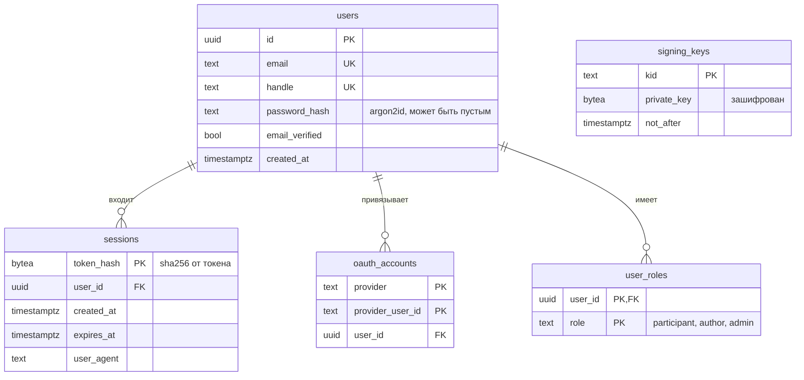
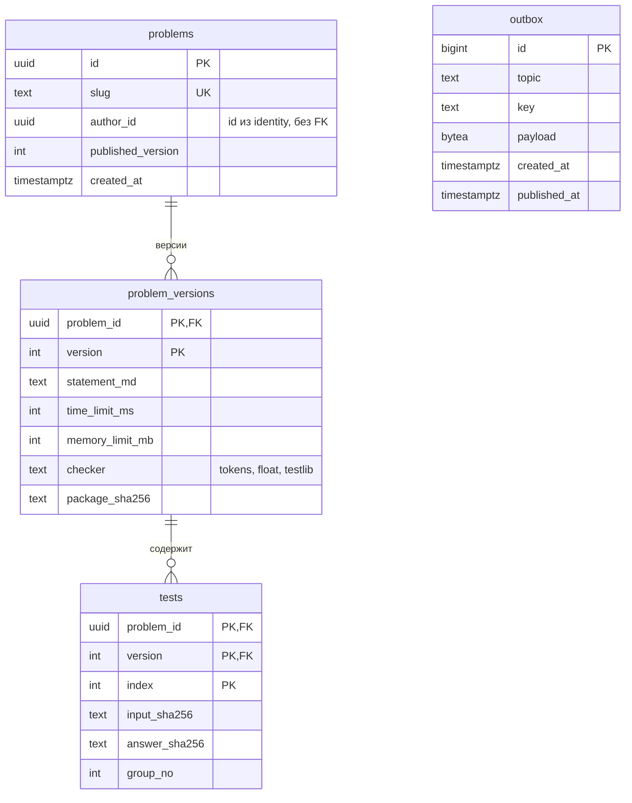
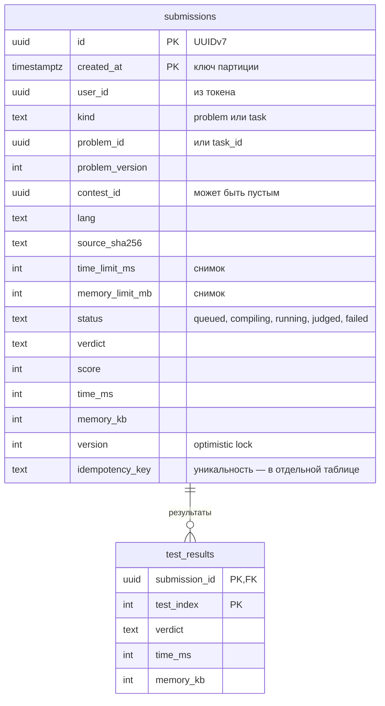
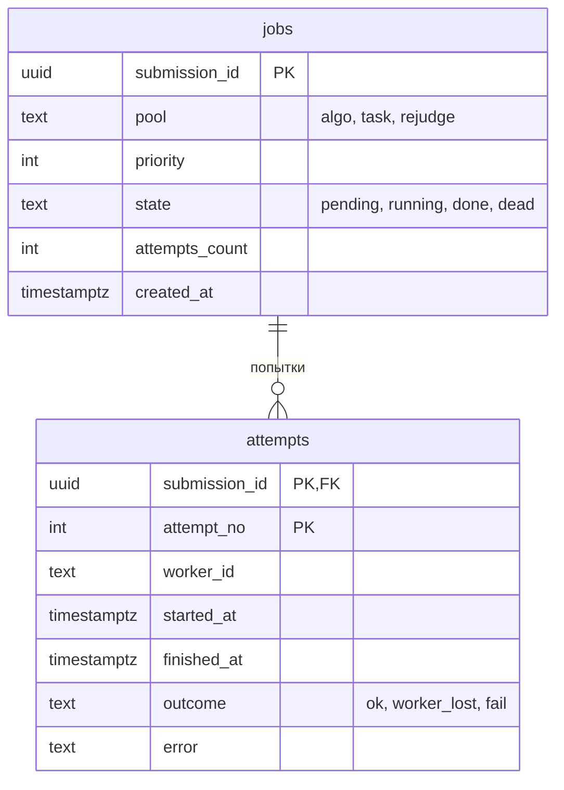
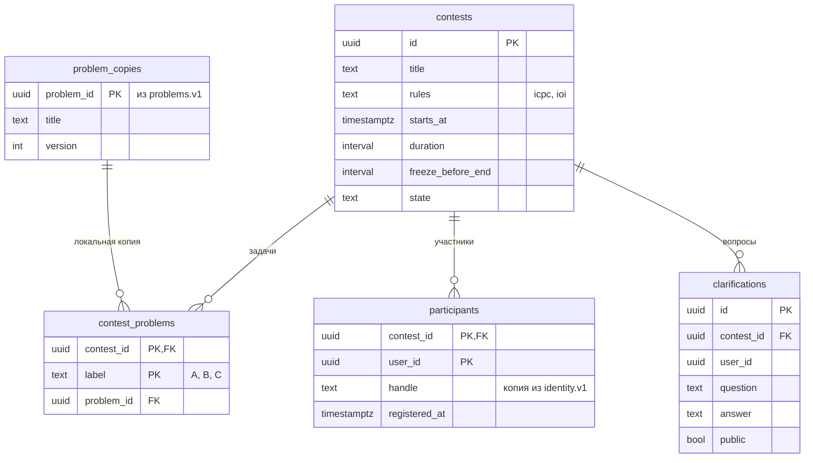
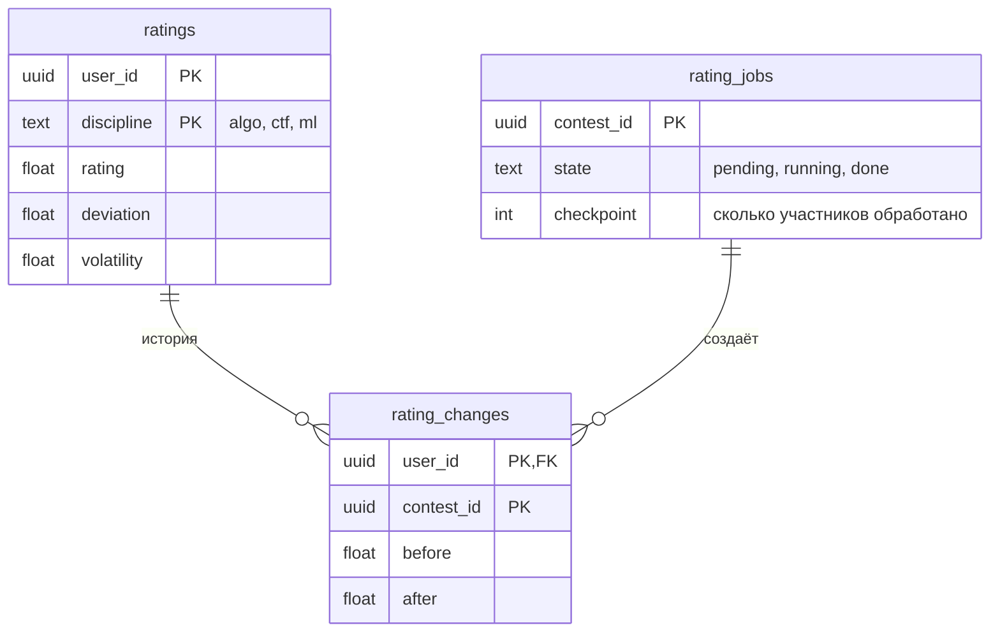

# Данные

У каждого сервиса своя база. В одном кластере PostgreSQL это отдельные базы с отдельными ролями: роль problems физически не может прочитать базу identity. Ссылки между сервисами — это просто id без внешних ключей. Если сервису часто нужны чужие данные, он держит их локальную копию, которую обновляют события.

## Где что хранится

| Данные | Сервис-владелец | Хранилище | Почему там |
| --- | --- | --- | --- |
| Пользователи, сессии, OAuth-аккаунты, роли | identity | PostgreSQL | Транзакции, уникальность email и ника |
| Задачи, версии, лимиты | problems | PostgreSQL | Версионирование и связи |
| Тесты, пакеты задач | problems | S3 по sha256 | Большие файлы, дедупликация по хэшу |
| Сабмиты и статусы | submissions | PostgreSQL, партиции по месяцам | Самая большая таблица, отсечение партиций |
| Код решений | submissions | S3 по sha256 | Большие и неизменяемые данные |
| Попытки проверки, dead letter | judge-orchestrator | PostgreSQL | История попыток и причины неудач |
| Кэш тестов на ноде | judge-worker | Локальный диск, LRU | Не качать тесты на каждую проверку |
| Контесты, регистрации, вопросы | contests | PostgreSQL | Связи и транзакции |
| Таблицы результатов | standings | Redis sorted sets | Быстрая сортировка; пересобирается из Kafka |
| Рейтинг и его история | rating | PostgreSQL | Аудит изменений |
| Счётчики rate limit | pkg/ratelimit | Redis | Атомарные операции и TTL |
| Аналитика | analytics | ClickHouse | Колоночные агрегаты по миллионам строк |
| Задания ШАД и шаблоны | tasks | PostgreSQL, S3 | Спецификация в базе, файлы в S3 |
| Курсы, дедлайны, ведомость | courses | PostgreSQL | Связи и расчёт оценок |
| Git-репозитории | git-server | Диск, бэкап через `git bundle` в S3 | Git работает с файловой системой |
| Эмбеддинги разборов | tutor | PostgreSQL + pgvector | Векторный поиск рядом с данными |

## identity

## problems

## submissions

`idempotency_key` уникален в паре с `user_id`. В партиционированной таблице уникальный индекс обязан включать ключ партиции, поэтому ключ идемпотентности вынесен в отдельную небольшую таблицу — это одна из ловушек, которую предстоит обнаружить в задаче про партиционирование.

## judge-orchestrator

## contests и rating

## Роли и доступ

- У каждого сервиса роль `<сервис>_app` с правами только на свою базу и роль `<сервис>_migrator` для миграций.
- Миграции лежат в `services/<сервис>/migrations` и выполняются при деплое отдельным шагом, до старта новой версии.
- Миграция должна быть совместима со старой версией кода: сначала добавить колонку, потом начать писать, потом удалить старое (expand и contract).
- В вехе 10 в таблицы с данными организаций добавляется `org_id` и политики RLS.
