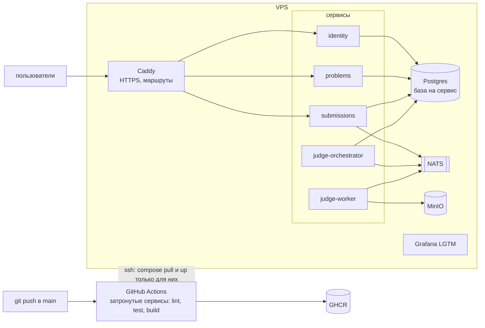
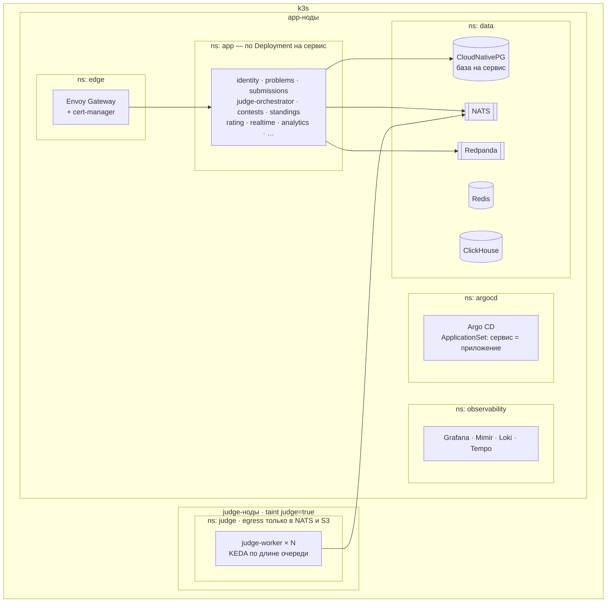
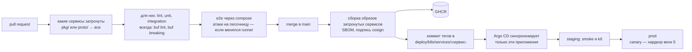

# Деплой и окружения

До вехи 5 все сервисы живут на одном VPS в docker compose: так продукт быстрее доходит до людей. В вехе 5 они переезжают в k3s-кластер с GitOps: каждый сервис — отдельное приложение Argo CD, а чужой код исполняется только на отдельной judge-ноде. В обоих случаях CI собирает и выкатывает только изменённые сервисы.

## Окружения

| Окружение | Где | Как деплоится | Веха |
| --- | --- | --- | --- |
| local | Свой компьютер: docker compose, потом kind + Tilt | `task up` | 0 |
| prod v1 | Один VPS, docker compose, Caddy | CI по SSH обновляет изменённые сервисы | 0–4 |
| staging | Неймспейс в k3s, анонимизированные данные | Argo CD из main | 5 |
| prod v2 | k3s: app-ноды и judge-нода | Argo CD, тег образа в git | 5 |

## prod v1: VPS



Риск: чужой код исполняется на той же машине, что и базы. До вехи 5 защищает только песочница, поэтому первые пользователи — друзья, а не публичный доступ. В вехе 5 judge уезжает на отдельную ноду.

## prod v2: Kubernetes



## CI/CD в монорепе



Мёрж в main возможен только через PR с зелёной проверкой `ci-ok` (ruleset на main, см. [security.md](security.md#защита-репозитория)). `ci-ok` — итоговая job в `.github/workflows/ci.yml` (до #12 — заглушка): она зависит от всех остальных, поэтому ruleset не нужно менять при добавлении новых проверок. Пропущенная job считается зелёной, так что `ci-ok` запускается с `if: always()` и сама проверяет результаты `needs`.

## Шаблон деплоя сервиса

Каждый сервис описывается несколькими строками, остальное даёт общий шаблон:

```yaml
# deploy/k8s/services/submissions/values.yaml
name: submissions
image: ghcr.io/nervan-iwnl/epoch-submissions
replicas: 2
resources: { cpu: 200m, memory: 256Mi }
database: submissions            # база и роль создаёт CloudNativePG
calls: [problems]                # попадает в NetworkPolicy
consumes: [nats, kafka]
routes:
  - prefix: /epoch.submissions.v1.SubmissionsService/
```

Из `calls` и `consumes` генерируются сетевые политики: сервис может ходить только к тому, что объявил.

## Бэкапы

| Что | Как | Как часто | Проверка восстановления |
| --- | --- | --- | --- |
| Базы сервисов | CloudNativePG: base backup + архив WAL в S3 | Бэкап раз в сутки, WAL непрерывно | Раз в месяц PITR в отдельный кластер |
| S3 с кодом и тестами | Версионирование бакета + копия в другой регион или провайдер | Непрерывно | Раз в квартал |
| Git-репозитории | `git bundle` в S3 | Раз в сутки | Раз в квартал |
| Kafka | Не бэкапится: источник правды — базы сервисов и outbox | — | Пересборка проекций из баз |
| Redis | Не бэкапится: таблицы пересобираются из Kafka | — | Удалить и пересобрать на game day |
| Конфигурация кластера | Всё в git, секреты зашифрованы | При каждом изменении | `terraform apply` и Argo CD на пустом кластере |

## Секреты

- В git — только зашифрованное (SOPS или External Secrets).
- У каждого сервиса свой набор секретов и своя роль в базе.
- Ключи подписи внутренних токенов — только у identity; остальные сервисы получают публичные ключи через JWKS.
- Ключи LLM-провайдеров — только у llm-gateway.
