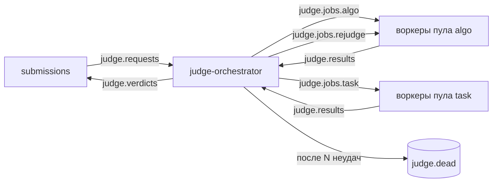
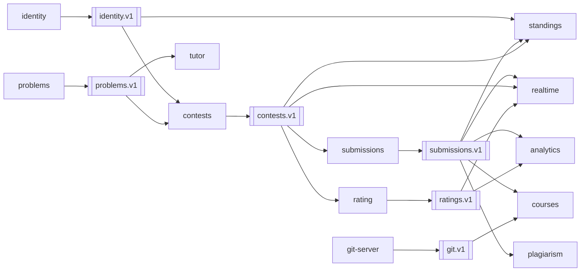
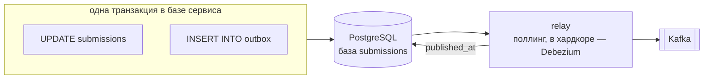
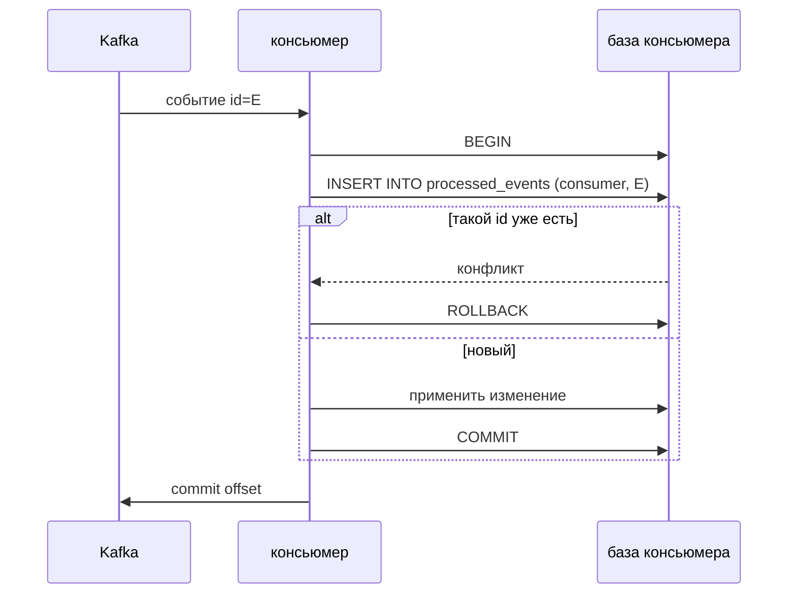

# Очереди и события

В системе два вида асинхронных сообщений. **Команды** («проверь этот сабмит») идут через NATS JetStream: у каждой ровно один исполнитель, нужны ack, повторы и dead letter. **Факты** («сабмит проверен») идут через Kafka: подписчиков много, важен порядок по ключу и возможность перечитать историю. Оба типа описаны в proto, публикуются через outbox и несут `traceparent`.

## NATS JetStream: проверка



| Subject | Кто пишет | Кто читает | Stream и политика |
| --- | --- | --- | --- |
| `judge.requests` | submissions | judge-orchestrator | `JUDGE_REQUESTS`, work queue |
| `judge.jobs.<пул>` | judge-orchestrator | judge-worker своего пула | `JUDGE_JOBS`, work queue, ack deadline 30 с с продлением |
| `judge.results` | judge-worker | judge-orchestrator | `JUDGE_RESULTS`, work queue |
| `judge.verdicts` | judge-orchestrator | submissions | `JUDGE_VERDICTS`, work queue |
| `judge.dead` | judge-orchestrator | человек через админку | `JUDGE_DEAD`, хранится 30 дней |

Пулы: `algo` — олимпиадные задачи, `task` — задания в формате ШАД, `rejudge` — перепроверки с низким приоритетом. Воркер берёт столько задач, сколько у него свободных ядер.

## Kafka: факты



| Топик | Ключ | События | Кто читает | Хранение | Веха |
| --- | --- | --- | --- | --- | --- |
| `identity.v1` | `user_id` | `user.registered`, `user.renamed` | contests, standings — копия ников | compacted | 4 |
| `problems.v1` | `problem_id` | `problem.published`, `problem.updated` | contests, tutor | compacted | 4 |
| `submissions.v1` | `contest_id`, вне контеста — `user_id` | `submission.created`, `submission.judged` | standings, realtime, analytics, courses, plagiarism | 14 дней | 4 |
| `contests.v1` | `contest_id` | `contest.scheduled`, `contest.started`, `contest.frozen`, `contest.finished` | submissions — окно сабмитов, standings, rating, realtime | compacted | 4 |
| `ratings.v1` | `user_id` | `rating.changed` | realtime, analytics | 90 дней | 4 |
| `git.v1` | `repo_id` | `repo.pushed` | courses | 14 дней | 7 |
| `ctf.v1` | `ctf_id` | `flag.solved`, `instance.expired` | ctf, realtime, analytics | 30 дней | 8 |
| `usage.v1` | `org_id` | `usage.recorded` | orgs, analytics | 90 дней | 10 |

Compacted-топики хранят последнее состояние по ключу. Новый сервис может прочитать их с начала и собрать свою копию данных.

## Конверт события

```proto
syntax = "proto3";
package epoch.events.v1;

import "google/protobuf/any.proto";
import "google/protobuf/timestamp.proto";

message Event {
  string id = 1;                              // UUIDv7, по нему дедупликация
  string type = 2;                            // "submission.judged"
  google.protobuf.Timestamp occurred_at = 3;  // время факта, не публикации
  string key = 4;                             // ключ партиции
  string producer = 5;                        // сервис-источник
  string org_id = 6;                          // веха 10, пусто до неё
  google.protobuf.Any payload = 7;            // epoch.submissions.v1.SubmissionJudged и т. п.
}
```

`traceparent` передаётся в заголовках сообщения, а не в теле: так трейс продолжается, даже если консьюмер не разбирает payload.

## Outbox: изменение и событие в одной транзакции



Без outbox сервис может записать изменение и упасть до публикации, и событие потеряется. Может и наоборот: опубликовать событие, а транзакция откатится. Outbox даёт публикацию at-least-once, поэтому консьюмеры обязаны быть идемпотентными.

## Идемпотентный консьюмер



Для standings в Redis вместо таблицы используется множество обработанных id с TTL, и изменение применяется атомарно Lua-скриптом.

## Правила эволюции

1. Изменения только обратно совместимые: новые поля можно, удалять и менять тип нельзя. `buf breaking` проверяет это в CI.
2. Несовместимое изменение — новый топик `.v2`, старый живёт, пока не уйдут все консьюмеры.
3. Консьюмер игнорирует неизвестные типы событий, а не падает.
4. Сообщение, которое не удаётся обработать после N попыток, уходит в `<топик>.dlq`, а консьюмер идёт дальше.
