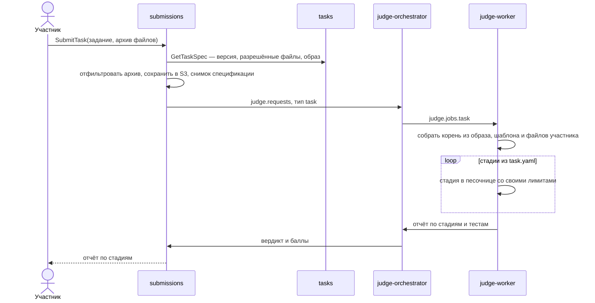
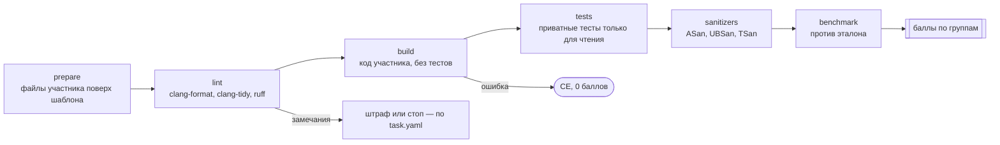
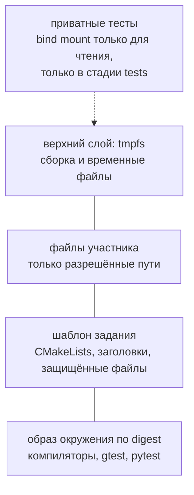

# Задания в формате ШАД

В олимпиадной задаче решение читает stdin и пишет stdout. В задании как в ШАД участник реализует класс, библиотеку или многопоточную структуру, а judge собирает код в окружении курса и гоняет по стадиям: линтер, сборка, приватные тесты, санитайзеры, бенчмарк. Баллы начисляются по группам тестов. Отправить решение можно файлами через CLI или сайт, а в вехе 7 — через git push.

## Кто участвует



Сообщения идут через NATS так же, как в [пути сабмита](submission-flow.md); здесь очередь опущена для краткости.

## Стадии



| Стадия | Что делает | Лимиты по умолчанию | Если упала |
| --- | --- | --- | --- |
| prepare | Берёт из отправки только разрешённые пути, остальное — из шаблона | — | Предупреждение в отчёте |
| lint | Форматирование и статический анализ | 30 с CPU | Штраф или стоп |
| build | Сборка кода участника в библиотеку | 60 с CPU, 2 ГБ, 256 процессов | CE, дальше не идём |
| tests | Сборка тестов из шаблона и запуск против библиотеки | 20 с CPU, 512 МБ | Баллы только за прошедшие группы |
| sanitizers | Те же тесты в сборках с санитайзерами | 60 с CPU, память через cgroup | Обнуление группы или штраф |
| benchmark | Время участника против эталона в тех же условиях | 5 повторов | Баллы по отношению времени |

## Корневая файловая система



Слои складываются через overlayfs: образ снизу, над ним шаблон, над ним файлы участника, сверху — tmpfs для записи. Распакованные слои образа кэшируются на ноде по digest.

## Пример task.yaml

```yaml
id: lru-cache
version: 3
title: LRU-кэш
image: ghcr.io/nervan-iwnl/epoch-env-cpp@sha256:<digest>

editable:              # участник может менять только это
  - src/lru_cache.h
  - src/lru_cache.cpp
protected:             # всегда из шаблона
  - CMakeLists.txt
  - tests/**

stages:
  - name: lint
    run: clang-format --dry-run --Werror src/*
    on_fail: penalty
    penalty: 0.1

  - name: build
    run: cmake -B build -DCMAKE_BUILD_TYPE=Release && cmake --build build --target solution -j2
    limits: { cpu: 60s, memory: 2Gi, pids: 256 }
    on_fail: stop

  - name: tests
    mounts: [private-tests]
    run: cmake --build build --target tests -j2 && ./build/tests --gtest_output=xml:/out/report.xml
    report: junit
    limits: { cpu: 20s, memory: 512Mi }

  - name: asan
    run: cmake -B build-asan -DSANITIZE=address,undefined && cmake --build build-asan --target tests && ./build-asan/tests
    mounts: [private-tests]
    on_fail: zero-groups

  - name: benchmark
    run: ./build/bench
    compare_with: reference
    repeats: 5

groups:
  - { name: basic,       tests: "Basic.*",    points: 40 }
  - { name: eviction,    tests: "Eviction.*", points: 40 }
  - { name: performance, stage: benchmark,    points: 20 }
```

## Приватные тесты: как не дать им утечь

Код участника исполняется, а значит, может попытаться вытащить тесты. Каналы утечки и защита:

| Канал | Защита |
| --- | --- |
| Сборочный скрипт участника читает тесты | CMakeLists защищён, на стадии build тесты не смонтированы |
| Вывод теста в лог | Лог обрезается, участнику показывается только имя упавшего теста и сообщение ассерта |
| Сеть | Нет network namespace, сети нет ни на одной стадии |
| Код выхода и время работы как канал по одному биту | Показываются только вердикт и группа; число попыток ограничено |
| Запись в файл, который вернётся участнику | Участнику возвращается только отчёт, артефакты сборки — нет |
| Тесты в образе окружения | Тесты хранятся в tasks и S3, в образ никогда не попадают |

## Санитайзеры в песочнице

| Санитайзер | Ловит | Конфликт с песочницей | Решение |
| --- | --- | --- | --- |
| ASan | Выход за границы, use-after-free | Резервирует терабайты виртуальной памяти | Лимит памяти только через cgroup, без `RLIMIT_AS` |
| UBSan | Неопределённое поведение | Почти нет | — |
| TSan | Гонки данных | Медленнее в 5–15 раз, много памяти | Отдельные лимиты, несколько прогонов |
| LSan | Утечки памяти | Использует ptrace | Разрешить ptrace только внутри PID namespace или выключить LSan |

## Бенчмарк

- Эталон и решение участника гоняются на одной ноде, на тех же ядрах, подряд.
- Сначала прогрев, потом 5 повторов, берётся медиана.
- Баллы — по отношению времени: не хуже 1,5 эталона — полный балл, хуже 3 эталонов — ноль, между ними линейно.
- Если разброс повторов больше 10%, результат не засчитывается и проверка повторяется.
