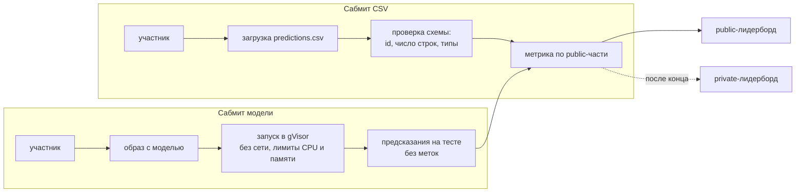
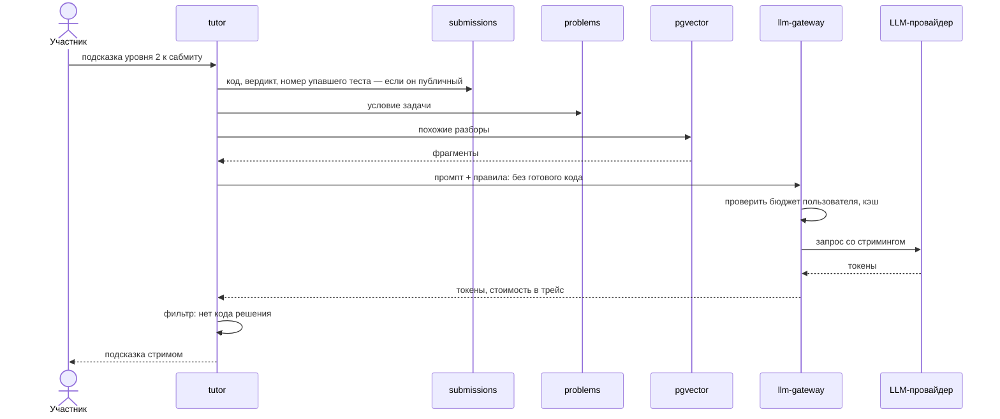
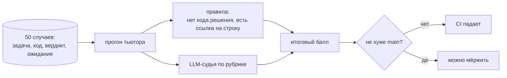

# ML-соревнования и AI-тьютор

ml-arena на Python проводит ML-соревнования: хранит датасеты, считает метрики и ведёт public и private лидерборды. tutor на Python даёт подсказки по задачам, не выдавая готового решения. Все запросы к LLM идут через llm-gateway на Go, который считает бюджет, кэширует и пишет трейсы. Качество тьютора проверяется eval-набором в CI, как обычный код.

## ML-соревнование: два способа сдать

## Public и private

- Тестовая выборка делится один раз, по фиксированному seed, например 30% на public и 70% на private.
- Во время соревнования участник видит только public-счёт.
- После конца открывается private — финальные места считаются по нему.
- Участник выбирает до двух сабмитов для финального зачёта. Если не выбрал — берутся лучшие по public.
- Метки private-части не попадают ни в ответы API, ни в логи, ни в окружение модели.

## Метрики как плагины

| Метрика | Для чего | Подводный камень |
| --- | --- | --- |
| Accuracy | Сбалансированная классификация | Врёт на несбалансированных классах |
| F1 | Несбалансированные классы | Зависит от порога |
| ROC AUC | Качество ранжирования | Не учитывает калибровку вероятностей |
| Logloss | Вероятностные предсказания | Взрывается на уверенных ошибках — нужен clip |
| RMSE | Регрессия | Чувствительна к выбросам |

Каждая метрика реализована руками и сверена с scikit-learn до 1e-9 — это задача вехи.

## Путь подсказки

## Уровни подсказок

| Уровень | Что даёт | Пример |
| --- | --- | --- |
| 1. Идея | Направление без деталей | «Подумай, что меняется, если отсортировать отрезки по правому концу» |
| 2. Подход | Алгоритм словами | «Жадность: бери отрезок с минимальным правым концом, который не пересекается с выбранными» |
| 3. Ошибка | Где ошибка в коде участника | «Цикл в строке 14 не учитывает отрезки, которые касаются концами» |

Готовый код решения тьютор не выдаёт никогда. Приватные тесты в промпт не попадают.

## Evals

Любое изменение промпта, модели или RAG прогоняет eval-набор. Случаи, где тьютор ошибся в проде, добавляются в набор.

## llm-gateway

- Один API для всех провайдеров, ключи провайдеров есть только у него.
- Бюджет токенов на пользователя и на организацию; превышение — отказ, а не счёт.
- Кэш по хэшу промпта для одинаковых запросов.
- Стриминг ответа до клиента.
- В трейсе: модель, число токенов, стоимость, время до первого токена.
