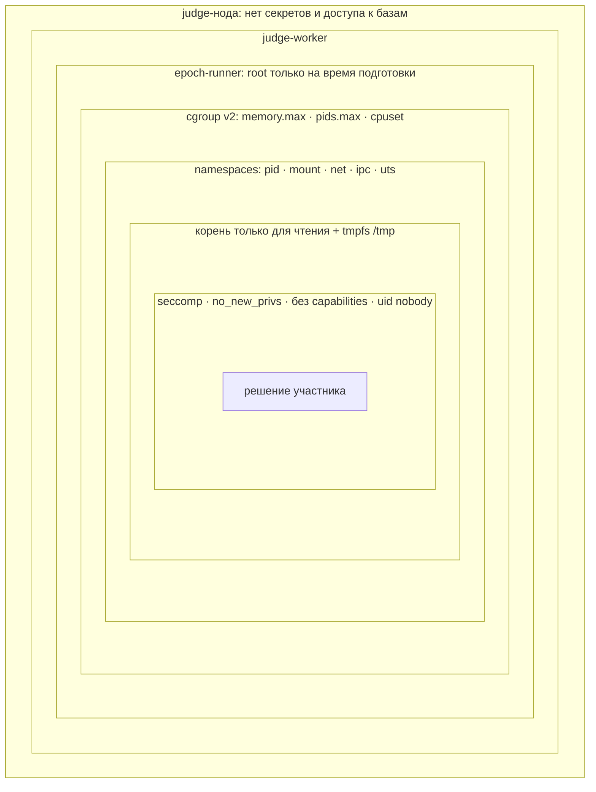
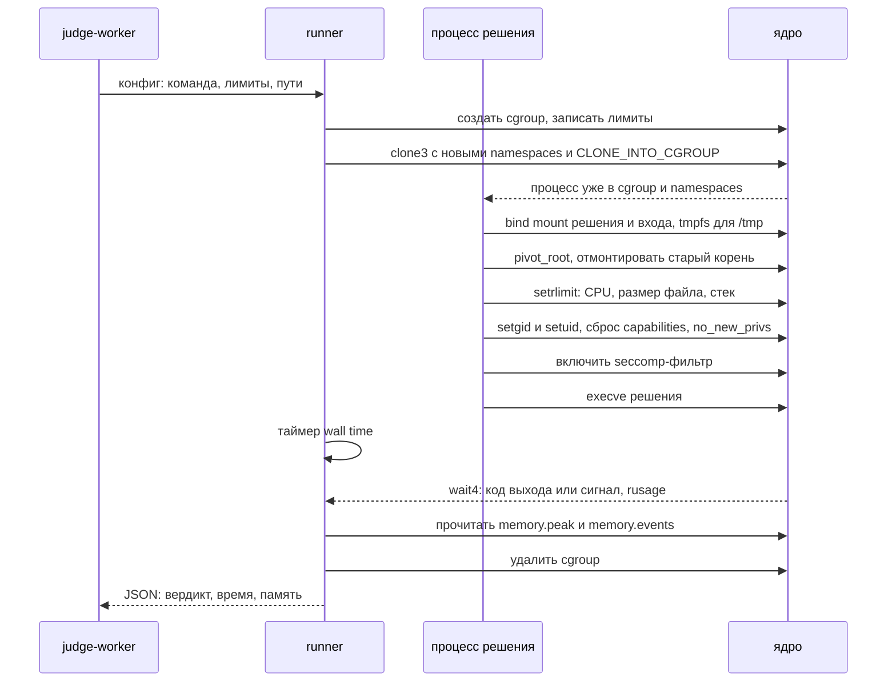
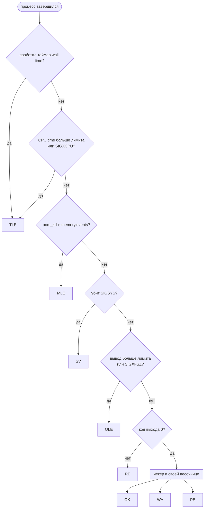

# Песочница: epoch-runner

`epoch-runner` запускает чужой код так, чтобы он не мог навредить: у него лимиты времени, памяти и процессов, нет сети, файлов хоста и привилегий. Это CLI и библиотека на Rust, которую использует judge-worker. Каждый слой защиты закрывает свой класс атак, и ни один не должен быть единственным.

## Слои изоляции

| Слой | Что закрывает | Веха |
| --- | --- | --- |
| rlimits и таймер | Бесконечные циклы, огромные файлы | 1 |
| cgroup v2 | Память, fork-бомбы, соседние ядра | 1 |
| PID namespace | Видимость и сигналы чужим процессам | 1 |
| Network namespace | Любая сеть | 1 |
| Mount namespace, `pivot_root`, read-only | Чтение файлов хоста и приватных тестов, запись куда не надо | 1 |
| seccomp | Опасные системные вызовы: `ptrace`, `mount`, `socket`, `bpf` | 1 |
| Сброс привилегий | Повышение прав через setuid и capabilities | 1 |
| Отдельная judge-нода | Последствия побега: рядом нет данных и секретов | 5 |
| gVisor | Уязвимости ядра — для ML-моделей и CTF-инстансов | 8–9 |

## Как проходит один запуск

Порядок важен. Процесс попадает в cgroup до `execve` через `CLONE_INTO_CGROUP`, иначе в короткое окно после старта он жил бы без лимитов. seccomp включается последним: после него `mount` и `setuid` уже запрещены.

## Как выбирается вердикт

## Атаки и защита

Каждая строка — отдельный тест в наборе атак, который гоняется в CI.

| Атака | Чем закрыто | Ожидаемый вердикт |
| --- | --- | --- |
| `while(true)` | `RLIMIT_CPU`, таймер | TLE |
| `sleep(1000)` | Таймер wall time | TLE |
| Fork-бомба | `pids.max` | RE или TLE, машина жива |
| Выделить 10 ГБ | `memory.max`, `memory.swap.max=0` | MLE |
| Писать вывод бесконечно | Лимит на размер вывода | OLE |
| Записать файл на 100 ГБ | `RLIMIT_FSIZE`, tmpfs с лимитом | OLE или RE |
| Прочитать `/etc/passwd` хоста | Свой корень через `pivot_root` | Файла нет |
| Прочитать приватные тесты | Тесты не смонтированы в песочницу | Файла нет |
| Открыть сокет | seccomp, пустой network namespace | SV |
| `ptrace` соседнего процесса | seccomp, PID namespace | SV |
| Тысячи потоков | `pids.max` считает и потоки | RE |
| Послать сигнал воркеру | PID namespace: воркера не видно | Процесс не найден |

## Стабильность замеров

Честный TLE важнее скорости проверки. Правила для judge-нод:

- Вердикт по времени считается по CPU time. Wall time — страховка, равная 2–3 лимитам.
- Каждый запуск закреплён за своим ядром через `cpuset`, соседние задачи на это ядро не попадают.
- На judge-нодах выключены SMT и turbo boost, частота CPU фиксирована.
- При старте воркер гоняет калибровочное решение. Если оно медленнее эталона больше чем на 10%, нода не берёт задачи.

Таблицу разброса до и после настройки нужно добавить сюда, когда будет готова задача про стабильные замеры.

## Языки и память

| Язык | Особенность |
| --- | --- |
| C++ | Компиляция — тоже в песочнице, со своими лимитами |
| Python | Время интерпретатора входит в лимит, лимит на задачу обычно умножают |
| Java | JVM нужно явно ограничить `-Xmx` под лимит cgroup, иначе MLE ещё до `main` |
| Go | `GOMAXPROCS=1` и `GOMEMLIMIT` под лимит, иначе рантайм видит ядра всей машины |

## Что почитать перед началом

- man7.org: `namespaces(7)`, `cgroups(7)`, `seccomp(2)`, `capabilities(7)`, `pivot_root(2)`
- docs.kernel.org → Control Group v2
- github.com/ioi/isolate и github.com/google/nsjail — готовые песочницы для сравнения
