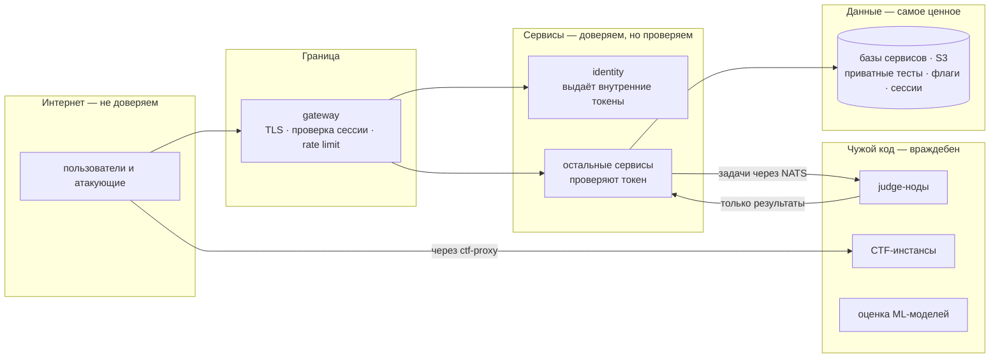
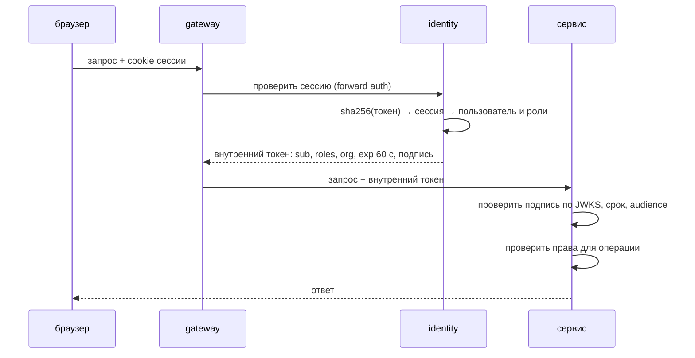

# Безопасность

Платформа по своей природе запускает чужой код и зовёт хакеров. Поэтому исходим из того, что любой сабмит, CTF-инстанс и ML-модель враждебны, а любой сервис может быть скомпрометирован. Защита многослойная. Граница решает, кто пришёл. Внутренний токен говорит сервисам, от чьего имени запрос. Сетевые политики ограничивают, кто кого может вызывать. Недоверенный код живёт в своей зоне, откуда не видно данных.

## Зоны доверия

## Аутентификация: от браузера до сервиса

- Cookie сессии никогда не уходит дальше gateway.
- Внутренний токен живёт минуту и подписан ключом identity. Сервисы кэшируют публичные ключи из JWKS.
- Заголовок вида `X-User-Id` без подписи сервисы игнорируют: его может подделать любой, кто достучался до сервиса в обход gateway.
- В вехе 10 к этому добавляется mTLS между сервисами через service mesh: сервис знает не только пользователя, но и какой сервис его вызвал.

## Что защищаем и от чего

| Что ценно | Угроза | Защита | Веха |
| --- | --- | --- | --- |
| Приватные тесты | Утечка через решение, логи, время работы | Не монтируются в build, обрезка логов, песочница без сети | 1, 6 |
| Хост judge | Побег из песочницы | namespaces, seccomp, сброс привилегий, отдельная нода, атаки в CI | 1, 5 |
| Базы сервисов | Доступ с judge-ноды или из чужого сервиса | Сетевые политики, отдельные роли, нет секретов на judge-нодах | 5 |
| Аккаунты | Перебор паролей, угон сессии | argon2id, rate limit, HttpOnly cookie, хэш токена в базе | 3 |
| Действия от имени пользователя | CSRF, XSS | SameSite, проверка Origin, санитайз, CSP | 3 |
| Внутренние вызовы | Подделка личности пользователя | Подписанный внутренний токен, JWKS | 3 |
| Флаги CTF | Утечка базы, шеринг флагов | HMAC вместо флагов, флаг на команду | 8 |
| Другие команды CTF | Атака с инстанса | Namespace на команду, egress запрещён, gVisor | 8 |
| Метки ML-соревнования | Чтение из окружения модели | Метки не попадают в окружение, gVisor без сети | 9 |
| Данные организаций | Утечка между тенантами | `org_id` в токене и событиях, RLS в базах | 10 |
| Цепочка поставки | Известная уязвимость в зависимости | Алерты и security-PR от Dependabot | 0 |
| Цепочка поставки | Подменённый образ или зависимость | Подпись cosign, SBOM, плановые обновления зависимостей (Dependabot или Renovate), проверка подписи при деплое | 5 |
| Ключи LLM | Утечка и расход чужого бюджета | Ключи только в llm-gateway, бюджеты на пользователя | 9 |
| Репозиторий | Секрет в git, изменение main в обход проверок | Secret scanning с push protection, ruleset на main | 0 |

## Защита репозитория

Включена с вехи 0, до появления кода.

| Что | Как настроено |
| --- | --- |
| Code scanning | CodeQL, default setup: языки подхватываются сами, сканируются PR, push в main и раз в неделю. Алерты во вкладке Security |
| Dependabot | Алерты и security-PR только для уязвимых зависимостей. `dependabot.yml` с плановыми обновлениями — когда появятся манифесты |
| Secret scanning | Алерты и push protection: push с токеном или ключом отклоняется |
| Ruleset `main` | Без удаления и force push, только через PR, обязательная зелёная проверка `ci-ok`. Админ обходит правила только при мёрже PR |
| Сообщения об уязвимостях | Private vulnerability reporting, порядок описан в `SECURITY.md` |

## Процессы

- **Атаки на песочницу в CI** — на каждый PR, который трогает runner или worker.
- **Самоаудит по OWASP Top 10** — в вехе 3, дальше раз в веху: `docs/security/audit-N.md`.
- **Game day** — в вехе 5: хаос и постмортем.
- **Задача «сломай judge»** — в вехе 8: внешние люди ищут дыры за флаг.
- **Правило для секретов** — ни одного секрета открытым текстом в git, ротация одной командой.
