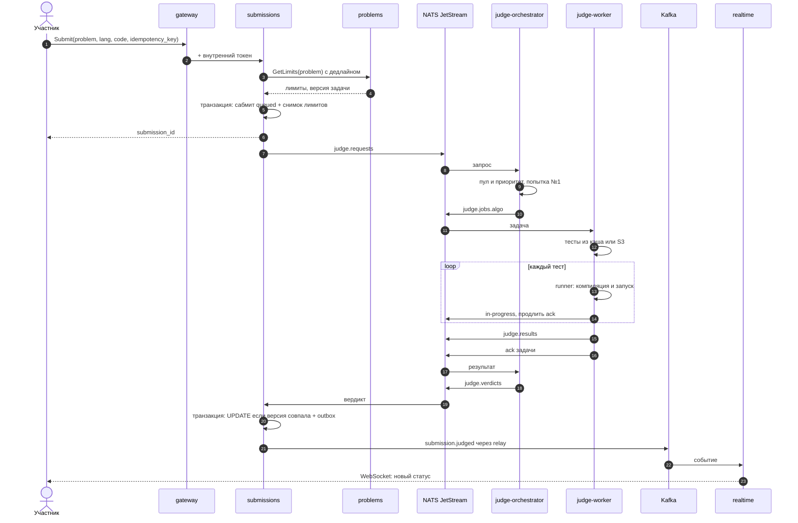
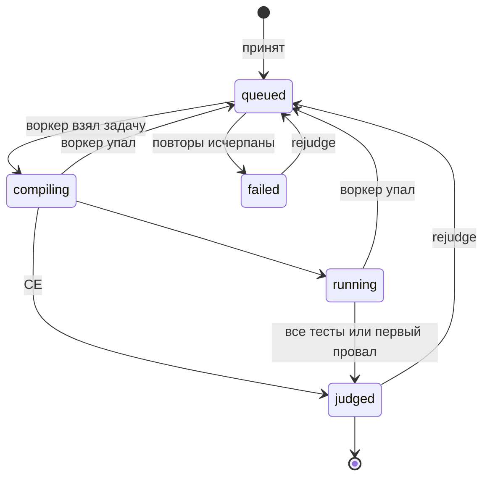

# Путь сабмита

Сабмит проходит через четыре сервиса: submissions принимает и хранит его, judge-orchestrator управляет очередями, judge-worker проверяет в песочнице, а по событию `submission.judged` обновляются таблица, рейтинг и аналитика. Главная гарантия — принятый сабмит всегда получит вердикт ровно один раз, даже если любой сервис упадёт посреди проверки.

## Последовательность

В вехе 2 шаги 21–23 устроены проще: Kafka ещё нет, статус в CLI приходит через server stream из submissions. Если сервис падает между сохранением сабмита (шаг 5) и публикацией (шаг 7), зависший `queued` перевыставляет sweeper. В вехе 4 публикации переезжают в outbox.

## Статусы сабмита

Статусы хранит submissions, попытки проверки — judge-orchestrator. Переход в недопустимый статус запрещён проверкой в `UPDATE ... WHERE status IN (...)`.

## Кто за что отвечает

| Сервис | Владеет | Не знает |
| --- | --- | --- |
| submissions | Сабмит, код, статус, итоговый вердикт, снимок лимитов | Как устроены очереди и пулы |
| judge-orchestrator | Попытки, пулы (`algo`, `task`, `course`), приоритеты, dead letter, rejudge | Кто автор и в каком контесте сабмит |
| judge-worker | Выполнение одной задачи от начала до конца | Базы данных любых сервисов |
| problems | Задача, лимиты, тесты в S3 | Что происходит с сабмитами |

## Гарантии

| Что может сломаться | Что происходит | Где закреплено |
| --- | --- | --- |
| Клиент повторил запрос | Тот же `idempotency_key` → тот же сабмит | Уникальный индекс в submissions |
| problems не отвечает при отправке | Быстрый отказ по дедлайну, сабмит не создаётся | Дедлайн и circuit breaker в `pkg/resilience` |
| problems упал после приёма | Проверка идёт: лимиты уже скопированы в сабмит | Снимок лимитов |
| submissions упал до публикации в NATS | Sweeper, потом outbox публикует запрос | Веха 2, потом веха 4 |
| Воркер упал посреди проверки | Нет ack — NATS передоставит задачу другому воркеру | Ack deadline + heartbeat |
| Задача валит воркеры раз за разом | После N попыток — dead letter и статус `failed` | judge-orchestrator |
| Вердикт пришёл дважды | Второй `UPDATE` не проходит по версии и статусу | Optimistic concurrency |
| Kafka недоступна | События копятся в outbox и уходят позже | `pkg/outbox` |
| Событие потерялось где-то ещё | Сверка находит расхождение и шлёт алерт | Периодическая сверка, веха 4 |

## Вердикты

| Вердикт | Значит |
| --- | --- |
| OK | Все тесты пройдены |
| WA | Неверный ответ |
| PE | Нарушен формат вывода |
| TLE | Превышено время: CPU или wall |
| MLE | Превышена память |
| OLE | Слишком большой вывод |
| RE | Ненулевой код выхода или сигнал |
| CE | Ошибка компиляции |
| SV | Запрещённый системный вызов |
| FAIL | Ошибка judge или чекера — виноваты мы, а не участник |

## Цели по времени

- p95 от сабмита до вердикта без учёта времени тестов — меньше 5 с.
- p99 — меньше 15 с.
- Потерянных вердиктов — 0: это проверяет сверка.
