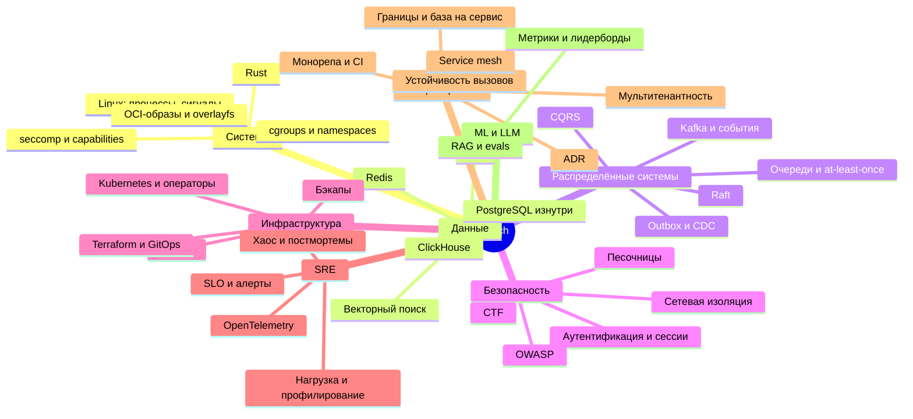

# Карта знаний

Проект задуман так, чтобы к концу роадмапа ты глубоко разбирался во всём программистском, кроме фронтенда. Здесь видно, какая веха что прокачивает и что читать. В самих issues есть блоки «Разберёшься в» и «Читать» под конкретную задачу, а здесь — общая картина.

## Области

| Область | Где в проекте | Ключевые идеи | Главные источники |
| --- | --- | --- | --- |
| **Go** | Вехи 0, 2, 4, 7, 10 | context и отмена, конкурентность без утечек, профилирование, чистые границы модулей | Effective Go; «100 Go Mistakes and How to Avoid Them» (Teiva Harsanyi); go.dev/blog |
| **Rust** | Вехи 1, 2, 6 | владение, ошибки, async и tokio, unsafe и FFI с libc | The Rust Book; «Rust for Rustaceans» (Jon Gjengset); «Rust Atomics and Locks» (Mara Bos) |
| **Linux и ОС** | Вехи 1, 6, 10 | процессы, сигналы, rlimits, cgroups v2, namespaces, seccomp, файловые системы, планировщик | «The Linux Programming Interface» (Michael Kerrisk); OSTEP (ostep.org); man7.org |
| **Сети** | Вехи 0, 3, 4, 8 | TLS, HTTP/2, WebSocket, TCP-прокси, SNI | «High Performance Browser Networking» (hpbn.co); Beej's Guide to Network Programming |
| **Базы данных** | Вехи 2, 4, 5, 9, 10 | транзакции и изоляция, индексы и планировщик, партиционирование, WAL и репликация, PITR, RLS, колоночное хранение | Документация PostgreSQL; use-the-index-luke.com; «Database Internals» (Alex Petrov); курс CMU 15-445 |
| **Распределённые системы** | Вехи 2, 4, 5, 10 | at-least-once и идемпотентность, лог событий, outbox, CQRS, durable execution, консенсус | «Designing Data-Intensive Applications» (Martin Kleppmann); MIT 6.5840; raft.github.io |
| **Безопасность** | Вехи 1, 3, 6, 8 | песочницы, пароли и сессии, OAuth2, OWASP Top 10, каналы утечки, сетевая изоляция, атакующее мышление | OWASP Cheat Sheet Series; OWASP ASVS; «Security Engineering» (Ross Anderson) |
| **Инфраструктура** | Вехи 0, 5, 8 | образы и слои, Kubernetes изнутри, операторы, Terraform, GitOps, секреты | Kubernetes the Hard Way; book.kubebuilder.io |
| **SRE и производительность** | Вехи 0, 2, 5, 6, 10 | трейсы и метрики, SLO и burn rate, нагрузочные тесты, flame graph, eBPF, хаос, постмортемы | «Site Reliability Engineering» и «The Site Reliability Workbook» (sre.google); «Systems Performance» (Brendan Gregg); «Release It!» (Michael Nygard) |
| **Микросервисы и архитектура** | Все вехи, особенно 0, 2, 4, 10 | границы сервисов, база на сервис, sync против async, устойчивость вызовов, распределённые трейсы, монорепа, ADR, мультитенантность, ReBAC | «Building Microservices» (Sam Newman, 2-е издание); microservices.io; «Release It!» (Michael Nygard); статья о Zanzibar (2019) |
| **Git изнутри** | Веха 7 | объекты, packfile, протокол, диффы | Pro Git, глава «Git Internals»; git-scm.com/docs |
| **ML и LLM** | Веха 9 | метрики и утечки данных, оценка моделей, эмбеддинги, RAG, evals | scikit-learn → Model evaluation; hamel.dev (про evals); github.com/pgvector/pgvector |
| **Фронтенд** | Все вехи с сайтом | — | Делегирован ИИ. Твоя часть — API. |

## Полка: что читать и когда

| Когда | Что | Зачем |
| --- | --- | --- |
| Веха 0 | «Building Microservices» (Sam Newman) — главы про моделирование сервисов и взаимодействие | Правильные границы сервисов с первого дня |
| Вехи 0–1 | «The Linux Programming Interface» — главы про процессы, сигналы, ресурсы и capabilities | Основа песочницы |
| Вехи 0–1 | The Rust Book и rustlings | Язык runner и воркера |
| Вехи 2–4 | «Designing Data-Intensive Applications» целиком | Главная книга про данные и распределённые системы |
| Вехи 2–4 | Документация PostgreSQL: Concurrency Control, Indexes, Using EXPLAIN, Partitioning | Понимать, что делает база |
| Веха 3 | OWASP Cheat Sheets: Authentication, Password Storage, Session Management, CSRF, XSS | Своя авторизация без дыр |
| Веха 5 | Kubernetes the Hard Way; «The Site Reliability Workbook» — главы про SLO и алерты | Кластер и эксплуатация |
| Вехи 6 и 10 | «Systems Performance» (Brendan Gregg) | Бенчмарки и профилирование |
| Веха 7 | Pro Git → Git Internals | Свой git-сервер |
| Вехи 2 и 5 | «Release It!» (Michael Nygard) | Как микросервисы падают каскадом и как это остановить |
| Веха 10 | MIT 6.5840 (лабы про Raft) | Консенсус |
| В любой момент | Курс CMU 15-445 (Andy Pavlo) | Как устроена СУБД изнутри |

## Как учиться на проекте

1. **Прочитай теорию под задачу**, а не всю книгу сразу: в issue указано, что именно.
2. **Сделай сам.** Застрял на 30–60 минут — проси у ИИ подсказку по уровням: направление → подход → конкретное место.
3. **Сломай.** Убей процесс, отключи сеть, пришли дубль — посмотри, что будет. Большинство задач так и сформулированы.
4. **Запиши** в журнал, что понял. Если не можешь объяснить в пяти предложениях, значит, ещё не понял.
