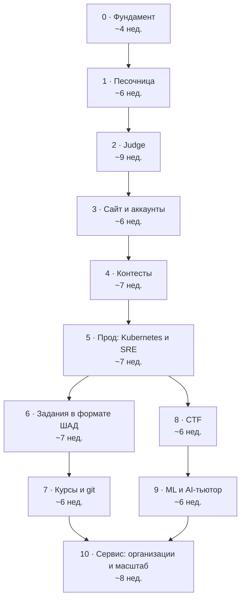

# Роадмап

11 вех, примерно 17 месяцев при 15–20 часах в неделю. Архитектура — микросервисы в монорепе с первого дня: сервисы появляются по мере того, как нужны продукту. Каждая веха заканчивается демо: чем-то, что можно показать живым людям. Задачи лежат в [issues](https://github.com/nervan-iwnl/Epoch/issues), разбиты на куски по вечеру, двум-трём вечерам или выходным и собраны на [доске](https://github.com/users/nervan-iwnl/projects/4).

## Порядок вех

Вехи 0–5 идут строго по порядку. После пятой можно выбрать ветку: сначала курсы (6 → 7) или сначала CTF и ML (8 → 9). Для ML-вехи нужен gVisor из CTF-вехи, поэтому 8 идёт раньше 9.

## Как растёт число сервисов

| После вехи | Сервисы |
| --- | --- |
| 0 | gateway, problems, identity (заглушки) |
| 1 | + epoch-runner (CLI и библиотека) |
| 2 | + submissions, judge-orchestrator, judge-worker, CLI `epoch` |
| 3 | identity по-настоящему, web |
| 4 | + contests, standings, rating, realtime, analytics |
| 5 | всё то же, но в Kubernetes; gateway переезжает на Envoy |
| 6 | + tasks |
| 7 | + courses, git-server, plagiarism |
| 8 | + ctf, ctf-operator, ctf-proxy |
| 9 | + ml-arena, llm-gateway, tutor |
| 10 | + orgs, webhooks; mTLS через service mesh |

## Вехи

| Веха | Что появляется | Демо — веха закрыта, когда | Чему учишься |
| --- | --- | --- | --- |
| [0. Фундамент](https://github.com/nervan-iwnl/Epoch/milestone/1) | Монорепа, шаблон сервиса, gateway, два сервиса, CI, деплой на VPS | Push в main — изменённые сервисы доезжают до VPS; запрос проходит gateway → problems → identity одним трейсом | Микросервисы в монорепе, Go-сервис, Docker, CI для монорепы, распределённые трейсы, TLS |
| [1. Песочница](https://github.com/nervan-iwnl/Epoch/milestone/2) | `epoch-runner` на Rust | Чужой код запускается с лимитами, без сети и файлов хоста; атаки в CI получают верные вердикты | Rust, процессы и сигналы, cgroups v2, namespaces, seccomp |
| [2. Judge](https://github.com/nervan-iwnl/Epoch/milestone/3) | problems, submissions, judge-orchestrator, judge-worker, CLI | `epoch submit` даёт вердикт за пару секунд; 20 задач; убитый воркер не теряет сабмит | База на сервис, NATS JetStream, идемпотентность, устойчивость вызовов, async Rust |
| [3. Сайт и аккаунты](https://github.com/nervan-iwnl/Epoch/milestone/4) | identity, проверка сессии на gateway, web | Друзья решают задачи в браузере; сервисы проверяют внутренний токен; аудит OWASP без критичных находок | Пароли, сессии, OAuth2, аутентификация между сервисами, CSRF/XSS/CORS |
| [4. Контесты](https://github.com/nervan-iwnl/Epoch/milestone/5) | contests, standings, rating, realtime, analytics | Контест на 10+ человек; таблица обновляется за 2 с; перезапуск Kafka не теряет вердикты | Kafka, outbox, eventual consistency, CQRS, WebSocket, ClickHouse |
| [5. Прод: Kubernetes и SRE](https://github.com/nervan-iwnl/Epoch/milestone/6) | Кластер, GitOps по сервисам, Envoy Gateway, SLO, бэкапы | Публичный контест на 50+ участников; SLO выполнены; game day с постмортемом | Kubernetes изнутри, Terraform, GitOps, сетевые политики, SLO, хаос |
| [6. Задания в формате ШАД](https://github.com/nervan-iwnl/Epoch/milestone/7) | tasks, стадии проверки в judge | 5 задач: сборка, приватные тесты, санитайзеры, линтер, бенчмарк, баллы по группам | OCI-образы, overlayfs, санитайзеры, методика бенчмарков |
| [7. Курсы и git](https://github.com/nervan-iwnl/Epoch/milestone/8) | courses, git-server, plagiarism | Курс из 5 домашек через git push с дедлайнами, ревью и антиплагиатом | Git изнутри, протокол git, диффы, антиплагиат |
| [8. CTF](https://github.com/nervan-iwnl/Epoch/milestone/9) | ctf, ctf-operator, ctf-proxy | CTF на 15+ задач, у команд свои инстансы, есть задача «сломай judge» | Операторы Kubernetes, сетевая изоляция, gVisor, TCP-прокси |
| [9. ML и AI-тьютор](https://github.com/nervan-iwnl/Epoch/milestone/10) | ml-arena, llm-gateway, tutor | ML-соревнование с private-лидербордом; тьютор проходит eval-набор | Оценка моделей, Python-сервисы, векторный поиск, LLM и evals |
| [10. Сервис](https://github.com/nervan-iwnl/Epoch/milestone/11) | orgs, webhooks, публичный API, mTLS | Внешняя организация проводит приватный контест; p99 чтения API < 300 мс | Мультитенантность, service mesh, ReBAC, производительность, Raft |

## Как идти

- **На неделю — столько, сколько реально успеть.** Задачи недели — «В работе», у каждой дедлайн. Остальное лежит в бэклоге и не давит.
- **Сначала сам.** 30–60 минут без подсказок, потом документация или вопрос ИИ. Так знания остаются.
- **Застрял** дольше, чем обещает метка размера, — разбей задачу на две и закрой первую половину.
- **Метка `хардкор`** — по желанию. Демо работает и без неё, но именно там растёт глубина.
- **Отстаёшь от сроков** — выкидывай хардкор, но не демо. Сроки вех — ориентир; дедлайны стоят только у задач ближайших двух недель.
- **Новый сервис — только через шаблон.** Микросервисы съедают время на рутину, шаблон её убирает.

## Когда веха закрыта

1. Демо проведено: не «работает у меня», а показано людям или выполнено по критерию.
2. В [журнале](journal/README.md) есть заметка: что понял, что было сложно, что сделал бы иначе.
3. Milestone закрыт на GitHub, незакрытые хардкор-задачи перенесены в бэклог.
